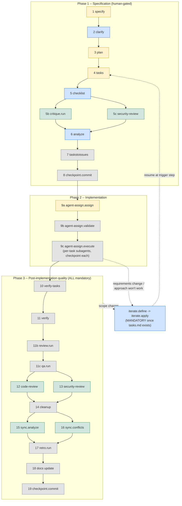

# SpecKit Setup

Automates the one-time SpecKit project bootstrap that otherwise has to be done by hand.
Runs `scripts/setup-speckit.sh`, which is idempotent (safe to re-run).

## When to use

- A repo needs SpecKit but `.specify/` doesn't exist yet.
- `/speckit.*` slash commands are missing or extensions are not installed.
- The user asks to "set up / initialize / enable SpecKit".

## What it does

`scripts/setup-speckit.sh` performs five steps:

1. **`specify init --here`** -- scaffolds `.specify/` (constitution, feature dirs, workflow
   state). Defaults to `--integration codex --script sh`; override with `--integration` /
   `--script`. The DAG hooks key off `.specify/feature.json` (or the git branch) to resolve
   the active feature, so this scaffold is a prerequisite.
2. **Register the community catalog** -- `specify extension catalog add --name community
   --install-allowed <catalog.community.json>`.
3. **Install + enable the 28 required extensions** -- `agent-assign`, `archive`, `brownfield`,
   `bugfix`, `checkpoint`, `cleanup`, `conduct`, `critique`, `diagram`, `doctor`, `fix-findings`,
   `fleet`, `github-issues`, `iterate`, `onboard`, `optimize`, `qa`, `reconcile`,
   `refine`, `retro`, `review`, `roadmap`, `security-review`, `status`, `tinyspec`, `verify`,
   `verify-tasks`, `worktree`. `agent-assign` is mandatory: steering routes implementation
   through it and the DAG hard-blocks the deprecated `/speckit.implement`. Most install from
   the community catalog by name. The setup list also supports inline custom sources for
   extensions whose catalog version lags upstream: `name=<archive-url>` (install a specific
   archive via `specify extension add NAME --from <url>`) or `name=latest-release:<owner>/<repo>`
   (resolve the newest GitHub release tag at setup time and install its archive — tracks
   latest without pinning). Custom-source installs are best-effort: an unreachable source
   warns and is skipped rather than aborting setup.
4. **Register extension commands for the requested integration** -- `specify extension add`
   only renders an extension's command files for the integration active at add-time, and
   `specify integration switch` re-registers all extensions only on a *genuine* switch
   (switch-to-self is a no-op). If extensions were added under a different integration than
   the one requested (e.g. the default `codex` init, then later `claude`), their commands are
   never rendered for the requested agent and a naive re-run won't fix it. This step forces a
   (re-)registration: one switch if the requested integration isn't active, or a
   bounce-through-another-integration-and-back if it already is. Offline (reads the local
   registry).
5. **Install workflow definitions** -- `speckit`, `speckit-quality`, `speckit-full`, via
   `specify workflow add` from this package's local `workflows/<id>/` dirs. Since spec-kit
   0.11.x, workflows are a first-class primitive, not extensions. The local `speckit` definition
   overrides the upstream `Full SDD Cycle` that `specify init` bundles, and routes implementation
   through the agent-assign flow instead of the deprecated `/speckit.implement`.

## How to run

```bash
# from the project root, after `uv tool install specify-cli`
bash scripts/setup-speckit.sh                 # defaults: codex integration, sh scripts
bash scripts/setup-speckit.sh --integration claude --script sh
bash scripts/setup-speckit.sh --force         # re-scaffold even if .specify/ exists
```

Then install this repo's orchestration bundle (agents + DAG hooks -- the layer that enforces
the workflow) and compile:

```bash
apm install speckit@<marketplace> --target claude,codex,agent-skills
apm compile --target codex,claude --no-constitution
```

Start the workflow with `/speckit.specify`.

## The workflow DAG

The orchestration layer (shipped by the `speckit-dag` skill) enforces a fixed graph: every
step is mandatory by default, ordering is fixed, and a hook layer hard-blocks out-of-order or
precondition-violating moves. Edges and conditions live in `speckit-dag-hooks/scripts/nodes.json`
(each node has a `pre` block with predecessors + preconditions and a `post` block with successors
+ postconditions).



Legend: yellow = approval gate - blue = interactive (needs user) - green = runs parallel with
its pair - grey = automatic. Dashed edges = the iterate loop.

## Step reference (mirrors the pre/post node store)

Each row is a `/speckit.<step>` command. "Next (default -> conditions)" reflects the
`post.md` successor edges; conditional branches are noted.

| Step | What it does | Produces | Next (default -> conditions) |
|------|-------------|----------|-----------------------------|
| `specify` | Create spec.md from requirements | `spec.md` | `clarify` - one-paragraph -> `tinyspec.classify`; bug -> `bugfix.report` |
| `clarify` | Interactive requirements clarification | `clarifications.md` | `plan` |
| `plan` | Architecture & implementation plan | `plan.md` | `tasks` -> `critique.run` if user requests critique first |
| `tasks` | Task breakdown with dependency graph | `tasks.md` | `checklist` |
| `checklist` | Requirements-quality gate over spec + plan + tasks | `checklist.md` | `critique.run` + `security-review` (parallel) -> `diagram.dependencies` if both skipped |
| `critique.run` | Plan/task quality critique | critique notes | `analyze` |
| `security-review` (5c) | Security review of plan/tasks | findings | `analyze` |
| `analyze` | Risk analysis, resolve gaps | (resolved gaps) | `taskstoissues` |
| `taskstoissues` | Create GitHub/GitLab issues | issues | `checkpoint.commit` |
| `checkpoint.commit` (8) | Snapshot before implementation | commit | `agent-assign.assign` |
| `agent-assign.assign` | Route each task to a specialized subagent | `agent-assignments.yml` | `agent-assign.validate` |
| `agent-assign.validate` | Validate agent assignments (read-only) | (no artefact; stdout report) | `agent-assign.execute` |
| `agent-assign.execute` | Per-task subagent execution, checkpoint each | code + `task-<n>.report.md` | `verify-tasks` -> `verify` if verify-tasks skipped; scope change -> `iterate` |
| `verify-tasks` | Detect phantom completions (fresh context) | `verify-tasks-report.md` | `verify` |
| `verify` | Validate code against FR/SC | `verify-report.md` | `review.run` |
| `review.run` (11b) | Full review cycle | findings | `qa.run` -> `fix-findings` if findings (after triage) |
| `qa.run` (11c) | QA retest of the implementation | QA results | `code-review` + `security-review` (parallel) -> `fix-findings` if failed |
| `code-review` (12) | General code-quality review | findings | `cleanup` (with 13 clean) |
| `security-review` (13) | Security/compliance review | findings | `cleanup` (with 12 clean) |
| `cleanup` | Auto-fix small issues, file issues for large | `cleanup-report.md` | `sync.analyze` |
| `sync.analyze` | Detect spec<->code drift | `sync-report.md` | `sync.conflicts` |
| `sync.conflicts` | Detect inter-spec contradictions | findings | `retro.run` |
| `retro.run` | Retrospective (needs full session context) | retro notes | docs update |
| `checkpoint.commit` (19) | Final commit | commit | (done) |
| `iterate.define` / `iterate.apply` | Scope change (MANDATORY once tasks.md exists) | `pending-iteration.md`, updated spec/plan/tasks | resume at the step where the change was triggered |

This table covers the default workflow path. The node store guards ~74 commands
in total, including optional/diagnostic ones (`status.*`, `doctor`, `diagram.*`,
`tinyspec.*`, `bugfix.*`, `worktree.*`, ...). Run
`/speckit.status.show` for the current state, or see the steering-speckit
Command Reference for the full list.

## Rules

- This skill only bootstraps the upstream spec-kit side. The orchestration that ENFORCES the
  DAG (agents, hooks, node store) comes from the APM `speckit` bundle -- install it too.
- Do not hand-edit `.specify/` scaffolding or invent extension ids; the set above is what the
  DAG nodes expect. Keep the extension list in sync with the script's `EXTENSIONS` array.
- The script is idempotent; prefer re-running it over partial manual fixes.
