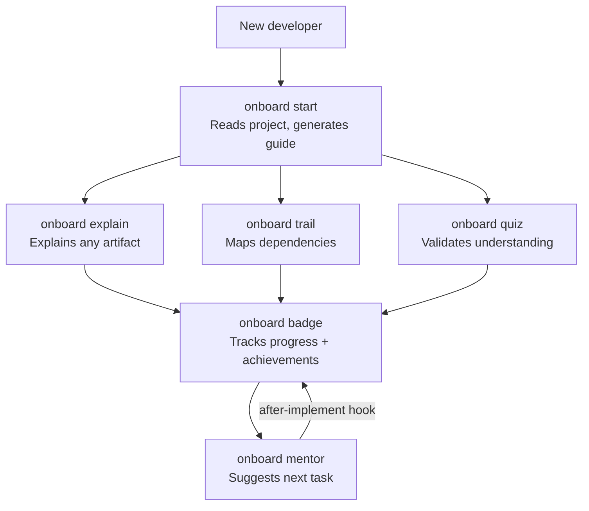

# spec-kit-onboard

> spec-kit extension for contextual onboarding and progressive developer growth.

`onboard` guides developers from their first contact with a project to full autonomy — orienting before action, validating understanding, and suggesting the next step.

---

## Workflow



---

## Installation

Add to your project's `.speckit/extensions.json`:

```json
{
  "extensions": [
    {
      "id": "onboard",
      "path": "path/to/spec-kit-onboard"
    }
  ]
}
```

---

## Commands

### `/onboard start`

Entry point. Reads all project artifacts and generates a personalized onboarding guide.

```bash
/onboard start
/onboard start --dev "Maria" --level junior
/onboard start --dev "Carlos" --level senior
```

Generates `.onboard/guide.md` with a project summary, feature map, recommended tasks, and a contextual glossary.

---

### `/onboard explain`

Explains any project artifact or SDD concept in plain language, calibrated to the developer's level.

```bash
/onboard explain features/auth/spec.md
/onboard explain features/payments
/onboard explain drift
/onboard explain hook
```

---

### `/onboard trail`

Generates a visual dependency map for a feature — tasks, blockers, hooks that will fire, and extensions involved.

```bash
/onboard trail auth
/onboard trail payments --format mermaid
```

Saves the map to `.onboard/trails/<feature>.md`.

---

### `/onboard quiz`

Validates the developer's understanding with 5 questions generated dynamically from the project's real artifacts.

```bash
/onboard quiz
/onboard quiz --feature auth
/onboard quiz --topic workflow
```

---

### `/onboard badge`

Displays the developer's progress as achievements.

```bash
/onboard badge
/onboard badge --list
/onboard badge --reset
```

**Available badges:**

| Badge           | Criterion                                                    |
| --------------- | ------------------------------------------------------------ |
| `first-read`    | First `/onboard explain`                                     |
| `map-reader`    | First `/onboard trail`                                       |
| `navigator`     | Quiz score of 5/5                                            |
| `first-task`    | First task completed                                         |
| `clean-pass`    | Task completed with no cleanup issues                        |
| `spec-aware`    | Read all specs of a feature before implementing              |
| `full-trail`    | Trail generated for all open features                        |
| `mentor-streak` | Followed the mentor's suggestion 3 times in a row            |
| `autonomous`    | Completed an entire feature without using `/onboard explain` |

---

### `/onboard mentor`

Suggests the next most suitable task based on the developer's level and history, with enough context to start immediately.

```bash
/onboard mentor
/onboard mentor --feature auth
```

---

## Generated files

All generated files go inside `.onboard/` in the user's project (gitignored by default):

```text
.onboard/
├── profile.json    — developer profile and progress
├── guide.md        — guide generated by /onboard start
└── trails/
    └── <feature>.md — maps generated by /onboard trail
```

---

## Integration with other extensions

| Extension                 | Integration                                                                    |
| ------------------------- | ------------------------------------------------------------------------------ |
| `cleanup`                 | `after-implement` hook reads the result to calculate the `clean-pass` badge    |
| `verify` / `verify-tasks` | `/onboard trail` lists the hooks that will fire during the feature cycle       |
| `docguard`                | `/onboard explain` displays the spec quality score (v1.1.0)                    |
| `learn`                   | `/onboard start` mentions `/learn guide` for post-implementation consolidation |

---

## Requirements

- spec-kit >= 0.1.0
- No external dependencies
