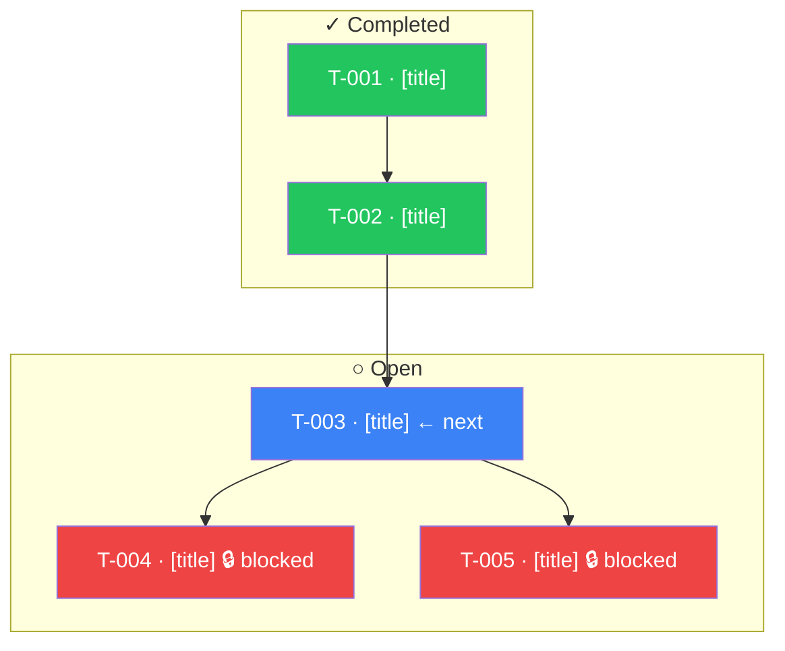

# Command: /onboard trail

## Syntax

```bash
/onboard trail <feature> [--format text|mermaid]
```

## Parameters

- `<feature>` (required): name of the feature to map
- `--format`: output format — `text` (default) or `mermaid`

---

## Agent instructions

You are executing the `/onboard trail` command of the spec-kit-onboard extension. Follow the steps below.

### Step 1 — Read the profile

Read `.onboard/profile.json`. If it does not exist, create it with default values (level `junior`, empty lists, all badges in `locked`, current timestamps).

### Step 2 — Validate the feature

Check whether `features/<feature>/` exists.

If not, respond: "Feature `[feature]` not found. Available features: [list folders in features/]."

### Step 3 — Structural collection (Trail generation stage 1)

Read the following files:

1. `features/<feature>/spec.md` — identify cross-references to other features (mentions of feature names, relative links to `features/`)
2. `features/<feature>/tasks.md` — extract all tasks with:
   - Task ID (e.g., T-001)
   - Title
   - Status (completed `[x]` / open `[ ]`)
   - Declared dependencies: `blocked-by`, `depends-on` fields, or patterns like "depends on T-XXX" in the text
3. `features/<feature>/plan.md` — read if it exists; extract additional phase information
4. `.speckit/extensions.json` — identify which hooks are active and which extensions have `after-implement`, `after-spec`, `before-implement` hooks

### Step 4 — Map generation (Trail generation stage 2)

**If `--format text` (default):**

Generate the map in the following format:

```text
✦ trail — features/<feature>

  Spec
  └── features/<feature>/spec.md
        [cross-references found, if any]

  Tasks (N total, N open)
  ├── [X] T-001 [title]
  ├── [X] T-002 [title]
  ├── [ ] T-003 [title]          ← next [if it is the next unblocked task]
  │         depends on → T-00X ✓
  └── [ ] T-004 [title]
            depends on → T-003

  Hooks that will fire
  [list of identified hooks, format: event → extension (brief description)]

  Extensions involved
  [list of extensions relevant to this feature]
```

Rules for the task tree:

- Completed tasks: marked with `[X]`
- Open tasks: marked with `[ ]`
- The next unblocked task (open and with no pending dependencies) gets `← next`
- Resolved dependencies marked with `✓`, pending ones without
- Blocked tasks (with unresolved dependencies) clearly show what blocks them

**If `--format mermaid`:**

Generate an interactive Mermaid diagram with color coding, click handlers, and subgraphs.

**Color coding by task status:**

- Completed tasks: green fill (`style T001 fill:#22c55e,color:#fff`)
- Next unblocked task: blue fill (`style T003 fill:#3b82f6,color:#fff`)
- Blocked tasks: red fill (`style T004 fill:#ef4444,color:#fff`)
- Open tasks (not next, not blocked): default style

**Click handlers:** add a `click` directive for each task linking to its position in `features/<feature>/tasks.md`:

```text
click T003 "features/<feature>/tasks.md" "View task"
```

**Subgraphs:** group tasks by status using `subgraph` blocks:



**Generation rules:**

- Use `flowchart TD` (not `graph TD`) for better layout support.
- Tasks with no dependencies are placed outside subgraphs if they don't fit logically.
- Cross-feature dependencies: add a separate node `EXT_feat["features/[other-feature]"]` with a dashed arrow: `EXT_feat -. depends on .-> T001`.
- If a feature has only one task, omit subgraphs and generate a single flat diagram.

Include the diagram inside a markdown code block with the `mermaid` tag.

### Step 5 — Save the file

Save the generated map to `.onboard/trails/<feature>.md` with the following header:

```markdown
# Trail — features/<feature>

Generated at: [date]

---

[map content]
```

### Step 6 — Update the profile and badges

Update `.onboard/profile.json`:

1. Add `<feature>` to the `trails_generated[]` array if not already there.
2. Update `last_updated`.
3. **Badge `map-reader`:** if `trails_generated` had length 0 before this execution, move `"map-reader"` from `locked` to `earned`.
4. **Badge `full-trail`:** check if `trails_generated` now contains all features with open tasks. If so, move `"full-trail"` from `locked` to `earned`.

If a new badge was unlocked, display:

```text
🏅 Badge unlocked: [badge-name]
```

Report at the end: `Trail saved to .onboard/trails/<feature>.md`

---

## Principles to follow

1. **Never invent dependencies.** Only extract dependencies explicitly declared in the artifacts.
2. **If `tasks.md` does not exist:** show only the Spec section and report "No tasks found for this feature."
3. **End with an action.** Suggest: "Run `/onboard mentor --feature <feature>` to get a suggestion for the next task."
